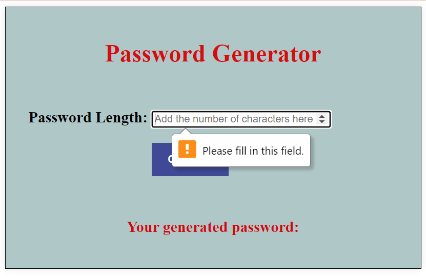
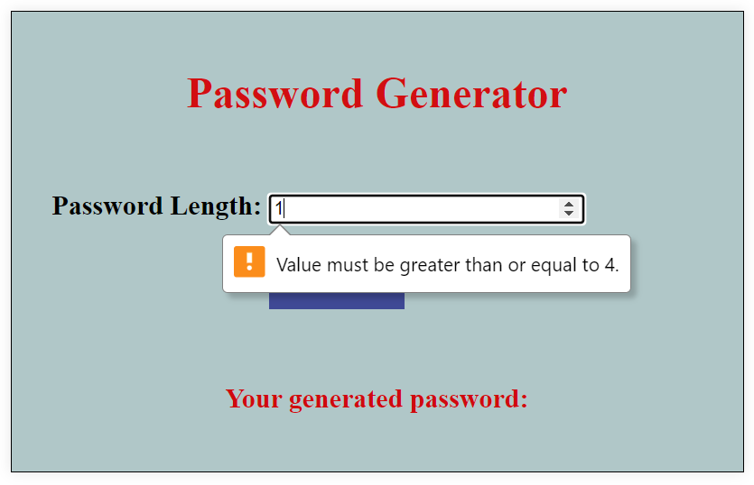
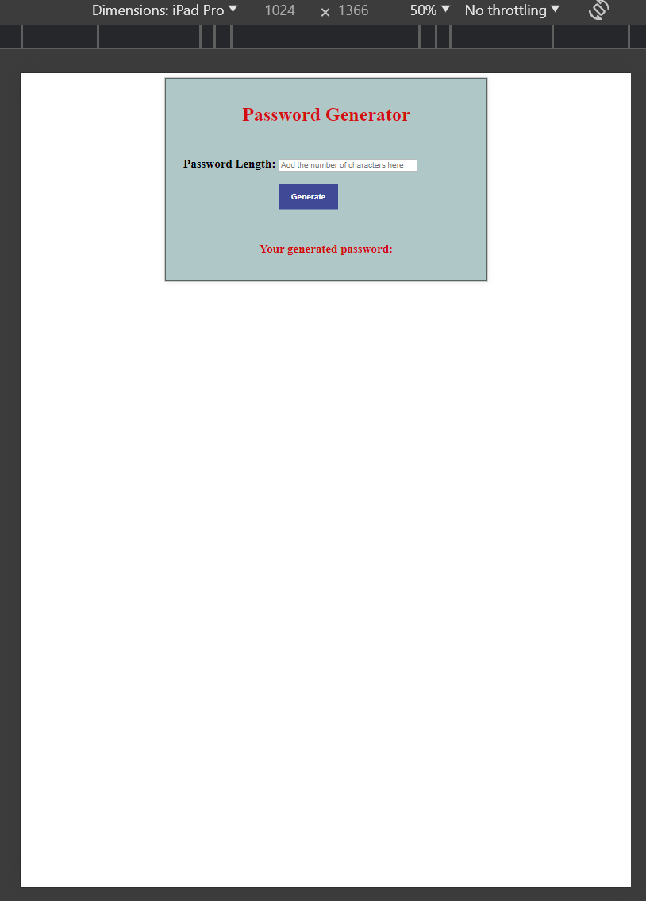
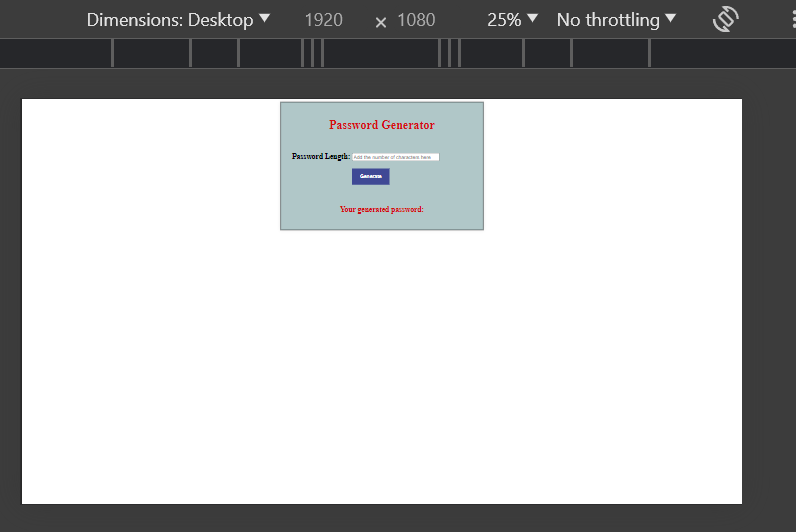
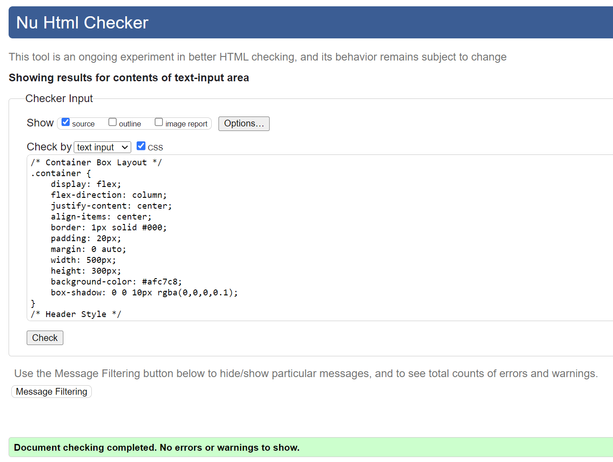

# Password Generator

## Description

This project is a Password Generator web application. It’s designed to provide users with a secure, random password at the click of a button. The objective of this application is to make it easy for users to generate strong, secure passwords that can help protect their online accounts from unauthorised access.

- [Check the Live Version Here](https://passgen-fb37ac1f0fdc.herokuapp.com/)

## Target Audience

The target audience for this application is anyone who uses the internet and needs to create secure passwords for their online accounts. This includes, but is not limited to, individuals who manage multiple online accounts, IT professionals, and organisations that prioritise online security.

## Importance and Usefulness

In today’s digital age, online security is more important than ever. One of the key aspects of online security is using strong, unique passwords for each of your online accounts. However, creating and remembering such passwords can be challenging.

That’s where this Password Generator comes in. It takes the hassle out of creating secure passwords. With just a click, you can generate a strong, random password. You can even customise the length of the password according to your needs, from 8 to 25 characters.

By using this Password Generator, you can enhance your online security with minimal effort. It’s a simple tool, but it can make a big difference in protecting your online presence.

## Why Access This Application

You should access this application if you want to:

- Improve your online security by using strong, unique passwords.
- Save time and effort in coming up with secure passwords.
- Have a user-friendly tool that can generate passwords for you in an instant.

Remember, a strong password is your first line of defense against unauthorised access to your online accounts. So why not give this Password Generator a try? It’s quick, easy, and could significantly boost your online security.

## Requirements

To run this Password Generator web application, you will need the following:

## Software

- Python: The application is written in Python, so you will need to have Python installed on your machine. The version used for this project is Python 3.7 or newer.
- Flask: Flask is a micro web framework written in Python. You can install it using pip, which is a package manager for Python. The command to install Flask is `pip install flask`.

## Libraries

The application uses the following Python libraries:

- Flask: As mentioned above, Flask is used to create the web application and handle HTTP requests.
- String: This is a built-in Python library used to generate the characters for the password.
- Random: This is another built-in Python library used to randomly select characters for the password.

## Files

You will need the following files, which are included in the project:

- `app.py`: This is the main Python script that runs the server and handles requests.
- `index.html`: This is the HTML file that defines the structure of the web page. It should be located in a templates folder in the same directory as your Python script.
- `style.css`: This is the CSS file that styles the web page. It should be located in a static folder in the same directory as your Python script.

## Testing

The application has been manually tested to ensure all features work as expected.

### Code Validation with PEP8

- **File**: app.py

**Initial `pycodestyle` Output**

- View [Output](./output.txt)

### Changes Made

- Added an extra blank line after the function definitions at lines 7, 12, and 19 to fix the E302 errors.
- Removed whitespace on blank lines at lines 19 and 20 to fix the W293 errors.
- Removed spaces around the equals sign at lines 14, 46, and 51 where parameters are being set to fix the E251 errors.
- Removed trailing whitespace at lines 28 and 33 to fix the W291 errors.

**Final `pycodestyle` Output**

## Code Creation

This project uses Python, a popular high-level programming language, and Flask, a lightweight web framework for Python. The code is divided into two main parts: the Python script that runs the server and handles requests, and the HTML file that defines the structure of the web page.

### Python Code

The Python code uses two libraries: Flask and the built-in Python libraries string and random.

#### Flask

Flask is used to create the web application and handle HTTP requests. Here’s how it’s used in the code:

- `app = Flask(__name__)`: This creates a new Flask web application.
- `@app.route('/', methods=['GET', 'POST'])`: This is a decorator that tells Flask what URL should trigger the `home()` function. The `methods` parameter lists the HTTP methods that are allowed for this route.
- `return render_template('index.html', password=password)`: This tells Flask to display the `index.html` file located in the templates folder. It also passes the generated password to the template.

#### String and Random

The string and random libraries are used to generate the password:

- `characters = string.ascii_letters + string.digits + string.punctuation`: This creates a string of all possible characters for the password.
- `password = ''.join(random.choice(characters) for i in range(length))`: This generates a random password of the specified length.

### HTML Code

The HTML code defines the structure of the web page. It includes a form for the user to specify the password length and a button to generate the password. The generated password is displayed in a paragraph (`
` element).

The HTML file also links to a CSS file (`style.css`) located in the static folder. This CSS file is used to style the web page.

### Why These Libraries and Statements?

Flask is a great choice for this project because it’s lightweight and easy to use, making it perfect for a simple web application like this one. The string and random libraries are part of Python’s standard library and provide a simple way to generate random passwords.

The statements in the code are necessary for the web application to function correctly. They define the behaviour of the application, such as what happens when the user submits the form (a new password is generated and displayed).

## Features

This Password Generator web application comes with a variety of features designed to provide a user-friendly experience for generating secure passwords. Here are the key features of this project:

1. **User-Friendly Interface**: The application features a clean, intuitive interface that makes it easy for users to generate passwords. Users simply need to enter the desired password length and click a button to generate a password.

2. **Customisable Password Length**: Users have the ability to specify the length of the generated password, from 4 to 25 characters, allowing for customisation based on individual security needs and requirements.

3. **Secure Password Generation**: The application generates secure passwords that include a mix of uppercase and lowercase letters, digits, and punctuation. This ensures that the generated passwords are strong and difficult to guess or crack.

4. **Real-Time Password Display**: The generated password is displayed in real-time on the webpage, providing immediate feedback to the user.

5. **Responsive Design**: The application features a responsive design that adjusts to different screen sizes. This means it can be used on a variety of devices, including desktop computers, laptops, tablets, and smartphones.

6. **Built with Python and Flask**: The application is built using Python and Flask, demonstrating the power and flexibility of these technologies for web development.

## Deployment

This section outlines the steps I took to deploy this project from my VSCode editor to GitHub and Heroku.

### Deploying to GitHub

1. **Initialise a Git repository**: In the VSCode terminal, I navigated to my project directory and ran `git init` to initialise a new Git repository.

2. **Commit my changes**: I added all the files to the staging area with `git add .`, then committed the changes with `git commit -m "Initial commit"`.

3. **Create a new repository on GitHub**: I went to GitHub and created a new repository.

4. **Link the local and remote repositories**: In my local repository, I added the URL of the remote repository with the command `git remote add origin https://github.com/LihMartins/passgen.git`.

5. **Push to GitHub**: I pushed my local commits to the remote repository with `git push -u origin main`.

## Deploying to Heroku

1. **Create a new app on Heroku**: I logged in to Heroku and created a new app.

2. **Prepare the app for deployment**: I ensured that my project had a `Procfile` and `requirements.txt` file. The `Procfile` contains the line `web: gunicorn app:app`.

3. **Commit any changes**: If I made any changes, I committed them with Git.

4. **Link the Heroku app to the local repository**: In my local repository, I linked the Heroku app with the command `heroku git:remote -a passgen`.

5. **Push to Heroku**: I pushed my local commits to the Heroku app with `git push heroku main`.

6. **Open the app**: Finally, I opened the app in a web browser with `heroku open`.

- [GitHub Repository](https://github.com/LihMartins/passgen)
- [Heroku Git](https://git.heroku.com/passgen.git)
- [Heroku Password Generator App](https://passgen-fb37ac1f0fdc.herokuapp.com/)

## Layout

**Main Page**

**Generating Password Result**

**Empty Field**

**Number Greater or Equal 4**

**Number Less or Equal 25**

**Mobile View**

**Tablet View**

**Desktop View**

## HTML and CSS Validators

Checked through [W3C Markup Validation Service](https://validator.w3.org/)

**HTML**

**CSS**

## Credits

The resources listed below played a pivotal role in the development and understanding of this project. They were instrumental during my research phase, enabling me to successfully build the application.

They served as a crucial learning curve, enhancing my knowledge and skills throughout the process.

- [Building a Password Generator Web Application with Flask - Secure Your Data](https://dev.to/y3script/building-a-password-generator-web-application-with-flask-secure-your-data-6e7)
- [Building a Password Generator and Strength Checker with Flask and HTML](https://medium.com/@amaltomparakkaden/building-a-password-generator-and-strength-checker-with-flask-and-html-e8b18374d397)
- [YouTube Video: Building a Password Generator](https://www.youtube.com/watch?v=XaVp2l6Z_Dc)
- [YouTube Video: Flask Tutorial](https://www.youtube.com/watch?v=XCIBOl3FTKo)
- [YouTube Video: Python Password Generator](https://www.youtube.com/watch?v=fsjXq2XURTY)
- [Password Generator in Python](https://www.shiksha.com/online-courses/articles/password-generator-in-python/)
- [YouTube Video: Deploying Flask App on Heroku](https://www.youtube.com/watch?v=QTOkqzCTGxw)
- [YouTube Video: Flask and Heroku Tutorial](https://www.youtube.com/watch?v=aUW5GAFhu6s)
- [What is Heroku?](https://www.heroku.com/about#:~:text=What%20is%20Heroku%3F,getting%20their%20apps%20to%20market.)
- [How Heroku Works](https://devcenter.heroku.com/articles/how-heroku-works)
- [What is Flask Python?](https://pythonbasics.org/what-is-flask-python/)
- [Getting Started with Python](https://www.python.org/about/gettingstarted/)
- [Python Tutorial](https://docs.python.org/3/tutorial/index.html)
- [Flask Tutorial on VSCode](https://code.visualstudio.com/docs/python/tutorial-flask)
